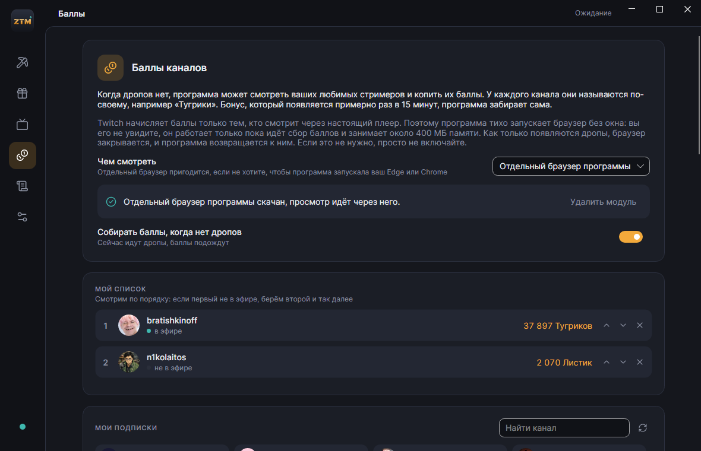
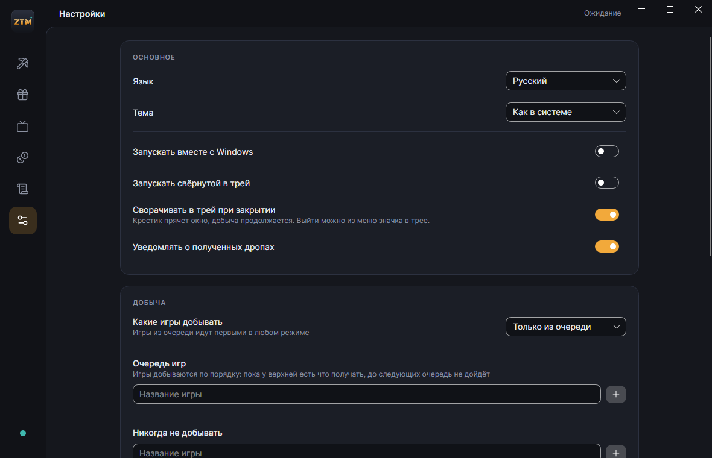
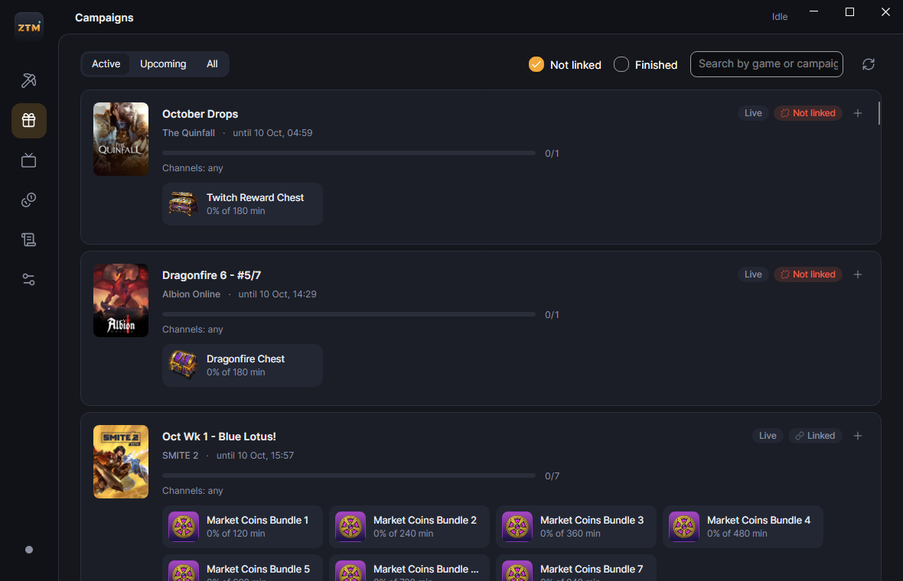
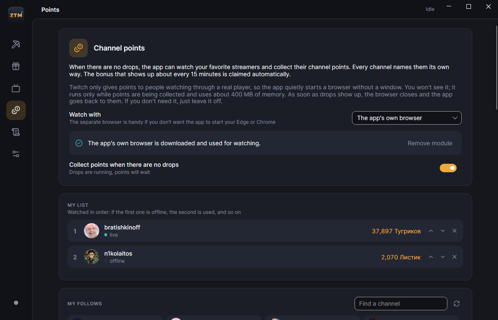
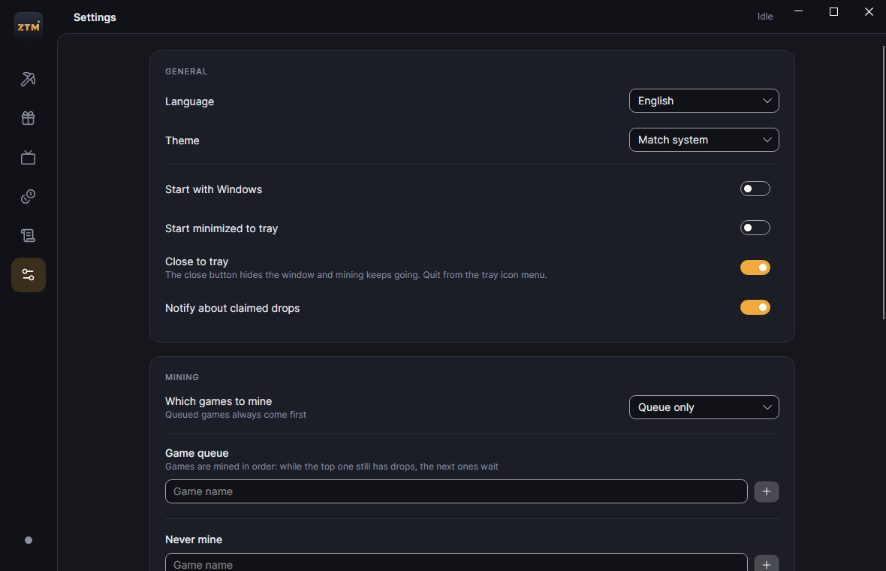

# ZeTwitchMiner

[Русский](#русский) · [English](#english)

## Русский

Делал для себя. Майнеры дропов, которыми пользовался раньше, толком не работали: то не входили в аккаунт, то не видели кампании, то просто зависали. Пользоваться ими было неудобно, да и память они ели прилично. В какой-то момент надоело с этим возиться, и я написал свой на C# и Avalonia.

Программа сама находит стримы с дропами, смотрит их за вас и забирает награды. Когда дропов нет, может копить баллы на каналах ваших любимых стримеров. Свёрнутая в трей, она занимает около 30 МБ.


### Установка

Берите из [Releases](https://github.com/zuckerigprod/ZeTwitchMiner/releases):

- `setup.exe` ставится в профиль пользователя, права администратора не нужны;
- `portable.zip` можно распаковать куда угодно, настройки и сессия будут лежать в папке `data` рядом с exe.

Нужна Windows 10 или 11 (64 бит).

### Как пользоваться

1. При первом запуске выберите язык.
2. Войдите в Twitch: программа покажет код, откройте twitch.tv/activate и введите его.
3. Во вкладке «Кампании» нажмите «+» у игр, дропы которых нужны, или добавьте их в «Настройки → Очередь игр». На «Добыче» очередь видно целиком, там же её можно переставить или убрать игру. Если хочется добывать всё подряд, переключите режим на «Сначала те, что скоро закончатся».
4. Если у кампании стоит «Не привязан», привяжите игровой аккаунт по ссылке на плашке, иначе Twitch награду не выдаст.

Дальше программа работает сама: выбирает канал, переключается, когда стрим заканчивается, и забирает дропы. Крестик сворачивает её в трей.

Twitch засчитывает минуты только тем, кто реально получает поток, поэтому программа держит выбранный стрим в режиме «только звук» и ничего не сохраняет. Это около 100 МБ трафика в час.

### Баллы каналов

Во вкладке «Баллы» видны ваши подписки. Добавьте в список каналы, на которых хотите копить баллы, и расставьте их по порядку. Когда дропов нет, программа смотрит первый канал из списка, который сейчас в эфире, и сама забирает бонус, который появляется примерно раз в 15 минут. Как только появляются дропы, она возвращается к ним.

Баллы Twitch начисляет только настоящему веб-плееру, поэтому для них программа запускает браузер без окна. Подойдёт Edge или Chrome, которые уже стоят на компьютере, а если их нет или не хочется их трогать, можно скачать отдельный браузер прямо из вкладки. Он занимает около 400 МБ памяти и работает, только пока идёт сбор баллов. По умолчанию всё это выключено.



### Остальное

Обновления программа проверяет сама и предлагает поставить новую версию в один клик.



Сессия шифруется средствами Windows и на другой компьютер не переносится.

### Если что-то сломалось

Twitch время от времени меняет внутренние запросы, и тогда майнер перестаёт видеть кампании. Хэши и запросы вынесены в `Twitch/twitch.json`, программа при запуске подтягивает его свежую версию из репозитория, так что обычно ничего переустанавливать не нужно.

Если не помогло, откройте issue и приложите журнал (вкладка «Журнал», кнопка «Копировать»).

### Сборка

Понадобятся .NET SDK 10, Visual Studio Build Tools с компонентом C++ (для NativeAOT) и Inno Setup 7 для установщика.

```powershell
pwsh ./build.ps1
```

Готовые файлы окажутся в `dist`.

---

## English

I made this for myself. The drop miners I used before never quite worked: they'd fail to sign in, miss campaigns or just hang. They were awkward to use and ate a fair amount of memory on top of that. At some point I got tired of fighting them and wrote my own in C# with Avalonia.

The app finds streams with drops, watches them for you and claims the rewards. When there are no drops, it can collect channel points on your favorite streamers' channels. Minimized to the tray it uses about 30 MB.



### Install

Grab a build from [Releases](https://github.com/zuckerigprod/ZeTwitchMiner/releases):

- `setup.exe` installs into your user profile, no admin rights needed;
- `portable.zip` can be unpacked anywhere; settings and the session are kept in a `data` folder next to the exe.

Requires Windows 10 or 11 (64-bit).

### Usage

1. Pick a language on first launch.
2. Sign in to Twitch: the app shows a code, open twitch.tv/activate and enter it.
3. On the Campaigns tab press "+" next to the games you want drops for, or add them under Settings → Game queue. The Mining tab shows the whole queue, where you can reorder it or drop a game. To mine everything, switch the mode to "Ending soonest first".
4. If a campaign says "Not linked", link your game account using the link on that badge, otherwise Twitch won't hand out the reward.

From there it runs on its own: picks a channel, switches when a stream ends and claims drops. The close button sends it to the tray.

Twitch only credits minutes to viewers who actually receive the stream, so the app keeps the chosen stream open in audio-only mode and discards it. That's about 100 MB of traffic per hour.

### Channel points

The Points tab shows the channels you follow. Add the ones you want to collect points on and put them in order. When there are no drops, the app watches the first channel on the list that's live and claims the bonus that pops up about every 15 minutes. As soon as drops show up, it goes back to them.

Twitch only gives points to a real web player, so the app starts a browser without a window for this. It can use the Edge or Chrome you already have, or, if you don't have them or would rather not have them touched, download a separate browser right from the tab. It takes about 400 MB of memory and only runs while points are being collected. All of this is off by default.



### Other

The app checks for updates on its own and offers to install a new version in one click.



The session is encrypted with Windows DPAPI and doesn't carry over to another PC.

### When something breaks

Twitch changes its internal queries from time to time, and the miner stops seeing campaigns. Hashes and queries live in `Twitch/twitch.json`, and the app pulls the latest version of that file from this repository on startup, so usually there's nothing to reinstall.

If that doesn't help, open an issue and attach the log (Log tab, Copy button).

### Building

You'll need the .NET 10 SDK, Visual Studio Build Tools with the C++ workload (for NativeAOT) and Inno Setup 7 for the installer.

```powershell
pwsh ./build.ps1
```

Output goes to `dist`.

---

MIT · [zuckerigprod](https://github.com/zuckerigprod)
